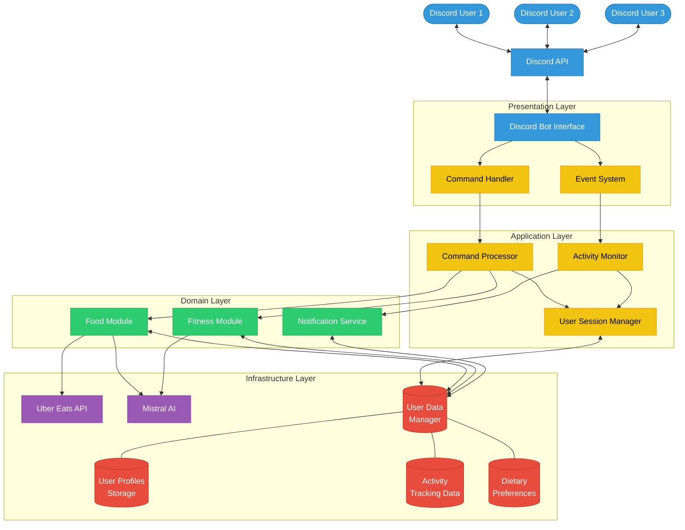

# GG_Nourish Technical Architecture

```mermaid
graph TD
    %% Main Components
    User([Discord User]) <-->|Commands & Messages| Discord[Discord Server]
    Discord <-->|Discord.py API| GGNourish[GG_Nourish Agent]
    
    %% Core Components
    GGNourish --> UserDataManager[User Data Manager]
    GGNourish --> FoodModule[Food Module]
    GGNourish --> FitnessModule[Fitness Module]
    GGNourish <--> MistralAI[Mistral AI v0.4.2]
    
    %% User Data Storage
    UserDataManager <--> UserDB[(User Profiles DB)]
    UserDB --> HealthGoals[Health Goals]
    UserDB --> DietaryPrefs[Dietary Preferences]
    UserDB --> ActivityData[Activity Tracking]
    UserDB --> Favorites[User Favorites]
    UserDB --> ConversationHistory[Conversation History]
    
    %% Food Module Components
    FoodModule --> UberEatsAPI[Uber Eats API]
    FoodModule --> RecipeGen[Recipe Generator]
    FoodModule --> FoodRec[Food Recommendations]
    UberEatsAPI --> RestaurantFilter[Restaurant Filtering]
    
    %% Fitness Module Components
    FitnessModule --> WorkoutUI[Workout UI Server]
    FitnessModule --> FitnessPlan[Fitness Plan Generator]
    FitnessModule --> ActivityMonitor[Activity Monitor]
    WorkoutUI --> Browser[Browser Timer UI]
    
    %% Dietary Safety System
    DietaryPrefs --> SafetyLayer1[Layer 1: Restaurant Filtering]
    DietaryPrefs --> SafetyLayer2[Layer 2: Menu Item Filtering]
    DietaryPrefs --> SafetyLayer3[Layer 3: Ingredient Verification]
    
    %% Command Processing
    GGNourish --> CommandProcessor[Command Processor]
    CommandProcessor --> FoodCmd[!food Command]
    CommandProcessor --> RecipeCmd[!recipe Command]
    CommandProcessor --> OrderCmd[!order Command]
    CommandProcessor --> DietaryCmd[!dietary Command]
    CommandProcessor --> HealthGoalCmd[!healthgoal Command]
    CommandProcessor --> FitnessPlanCmd[!fitnessplan Command]
    CommandProcessor --> WorkoutCmd[!workout Command]
    
    %% Styling
    classDef core fill:#f9f,stroke:#333,stroke-width:2px
    classDef module fill:#bbf,stroke:#333,stroke-width:1px
    classDef data fill:#bfb,stroke:#333,stroke-width:1px
    classDef api fill:#fbb,stroke:#333,stroke-width:1px
    classDef ui fill:#fbf,stroke:#333,stroke-width:1px
    classDef safety fill:#ff9,stroke:#333,stroke-width:1px
    
    class GGNourish,CommandProcessor core
    class FoodModule,FitnessModule,UserDataManager module
    class UserDB,HealthGoals,DietaryPrefs,ActivityData,Favorites,ConversationHistory data
    class UberEatsAPI,MistralAI api
    class WorkoutUI,Browser ui
    class SafetyLayer1,SafetyLayer2,SafetyLayer3 safety
```

## Architecture Description

GG_Nourish is built on a layered architecture that prioritizes modularity and safety:

### Architectural Layers

- **Presentation Layer**: Discord.py interface handles user interactions through an asynchronous event system
- **Application Layer**: Command processor routes requests to appropriate domain services
- **Domain Layer**: Specialized modules (Food, Fitness) encapsulate core business logic
- **Infrastructure Layer**: External integrations with Mistral AI and Uber Eats API

### Technical Highlights

- **Asynchronous Processing**: We leverage Python's asyncio for non-blocking operations, ensuring the bot remains responsive even during intensive tasks
- **Three-Tier Safety System**: Our dietary safety validation occurs at restaurant, menu, and ingredient levels
- **Context-Aware AI Integration**: Each request to Mistral AI includes user preferences, conversation history, and safety constraints

### Data Flow Architecture

1. User commands trigger event handlers in the presentation layer
2. The application layer enriches requests with user context from our data store
3. Domain services process the enriched commands and generate responses
4. The presentation layer formats and delivers responses back to Discord

## Key Components

- **Discord Bot Interface**: Handles all Discord API interactions
- **Command Processor**: Routes commands to appropriate modules
- **Activity Monitor**: Tracks user gaming activity and triggers notifications
- **Food Module**: Manages food recommendations and recipes
- **Fitness Module**: Handles workout plans and exercise breaks
- **User Data Manager**: Persistent storage for user preferences and activity data
- **External APIs**:
  - Mistral AI: Used for generating personalized content
  - Uber Eats API: Provides restaurant and food data

## System Components Description

### Core Components

1. **GG_Nourish Agent** (gg_nourish_agent.py)
   - Central controller that integrates all modules
   - Handles Discord event processing
   - Manages command routing and user interactions
   - Coordinates between modules for cohesive user experience

2. **User Data Manager** (user_data_manager.py)
   - Manages persistent storage of user profiles
   - Tracks health goals, dietary preferences, and activity data
   - Provides data to other modules for personalization
   - Stores conversation history for contextual awareness

3. **Food Module** (food_module.py)
   - Handles all nutrition-related functionality
   - Generates food recommendations based on user preferences
   - Creates personalized recipes with Mistral AI
   - Interfaces with Uber Eats API for restaurant recommendations

4. **Fitness Module** (fitness_module.py)
   - Manages workout and fitness functionality
   - Generates personalized fitness plans
   - Monitors user activity and suggests breaks
   - Controls the workout timer UI

### External Integrations

1. **Discord.py**
   - Provides interface to Discord API
   - Handles message events and command processing
   - Manages user interactions and message formatting

2. **Mistral AI v0.4.2**
   - Powers natural language understanding and generation
   - Creates personalized content for recipes, fitness plans, and food recommendations
   - Ensures recommendations align with dietary preferences and health goals

3. **Uber Eats API**
   - Provides restaurant data and menu information
   - Allows filtering based on location and dietary preferences
   - Supports health-focused restaurant recommendations

### Safety Systems

1. **Three-Layer Dietary Safety System**
   - **Layer 1: Restaurant Filtering** - Filters restaurants based on dietary tags
   - **Layer 2: Menu Item Filtering** - Filters individual menu items based on dietary compatibility
   - **Layer 3: Ingredient Verification** - Verifies individual ingredients against dietary restrictions

### User Interface Components

1. **Discord Bot Interface**
   - Primary user interaction point
   - Command processing and response generation
   - Rich embeds for restaurant and food recommendations

2. **Workout Timer UI**
   - Browser-based workout timer
   - 10-minute guided stretch routines
   - Visual countdown and exercise instructions

## Data Flow

1. User sends command to Discord server
2. GG_Nourish Agent receives command via Discord.py
3. Command Processor routes to appropriate handler
4. Handler retrieves user data from User Data Manager
5. Module-specific processing occurs (Food Module or Fitness Module)
6. External APIs are called if needed (Mistral AI, Uber Eats)
7. Response is generated and sent back to user
8. User data is updated based on interaction
9. Conversation history is stored for future context

## Key Features

1. **Personalized Recommendations**
   - Food and recipe suggestions based on health goals and dietary preferences
   - Fitness plans tailored to user's specific needs
   - Restaurant recommendations filtered for dietary safety

2. **Contextual Awareness**
   - Conversation history tracking for more natural interactions
   - Activity monitoring for timely workout break suggestions
   - Adaptive responses based on user preferences

3. **Dietary Safety**
   - Multi-layered filtering system for food recommendations
   - Strict adherence to user-specified dietary restrictions
   - Clear indication of dietary compatibility in recommendations

4. **Modular Architecture**
   - Separation of concerns for maintainability
   - Extensible design for adding new features
   - Loose coupling between components

## GG_Nourish Architecture Diagram

## Multi-User Architecture

GG_Nourish is designed as a multi-tenant application that can serve many users simultaneously:

### Multi-User Capabilities

- **Concurrent User Sessions**: The bot handles multiple user interactions simultaneously through Discord's asynchronous event system
- **User Isolation**: Each user's data, preferences, and activity tracking are isolated and securely stored
- **Shared Resource Optimization**: While each user has their own session, the system optimizes API calls by:
  - Pooling similar requests to external services
  - Caching common responses for frequently requested information
  - Managing rate limits across all users for external APIs

### User State Management

The Session Manager maintains:
- Active user sessions across Discord guilds (servers)
- User authentication and authorization states
- Conversation context for personalized AI responses
- Current interaction flows (e.g., food ordering process, workout session)

### Data Partitioning

User data is partitioned across several specialized stores:
- **User Profiles**: Core user information and preferences
- **Activity Tracking**: Time-series data for gaming sessions and breaks
- **Dietary Preferences**: Food restrictions, allergies, and cuisine preferences

### Scaling Considerations

- The architecture supports horizontal scaling by adding more bot instances
- Shared data stores enable seamless handoff between instances
- Stateless design principles allow for easy recovery from instance failures
